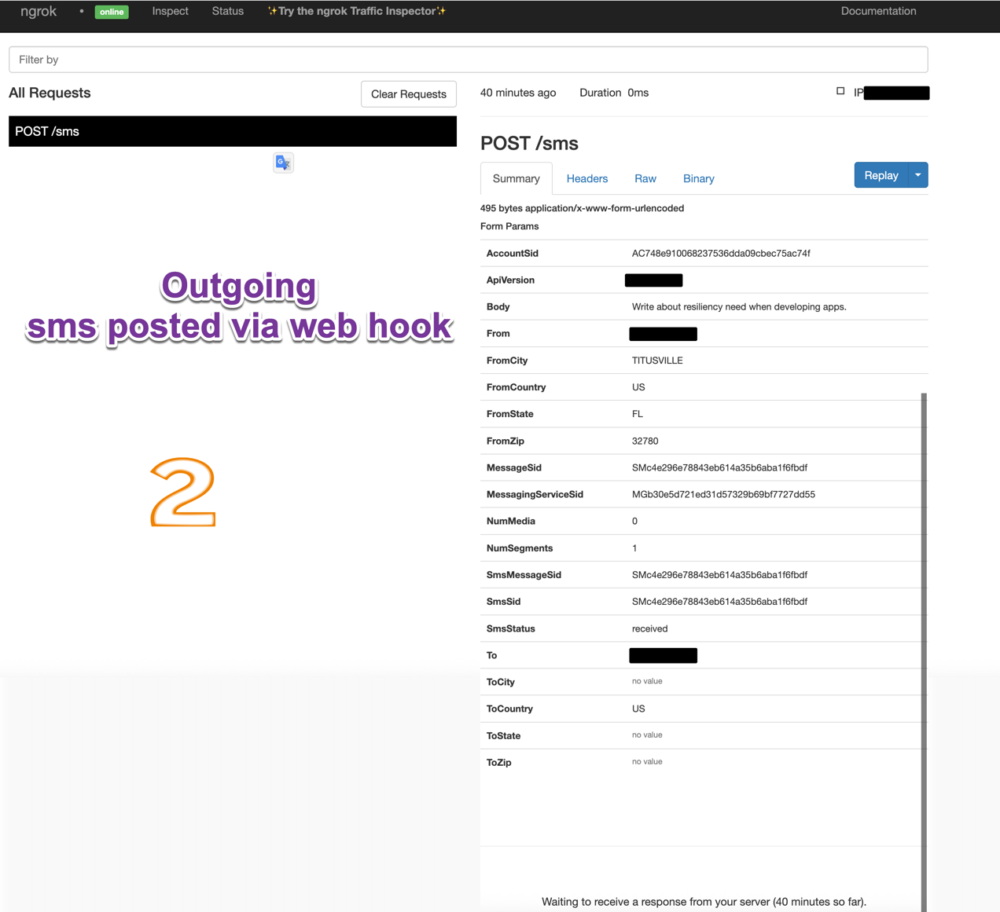
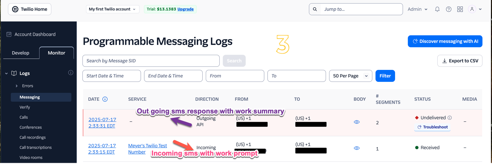
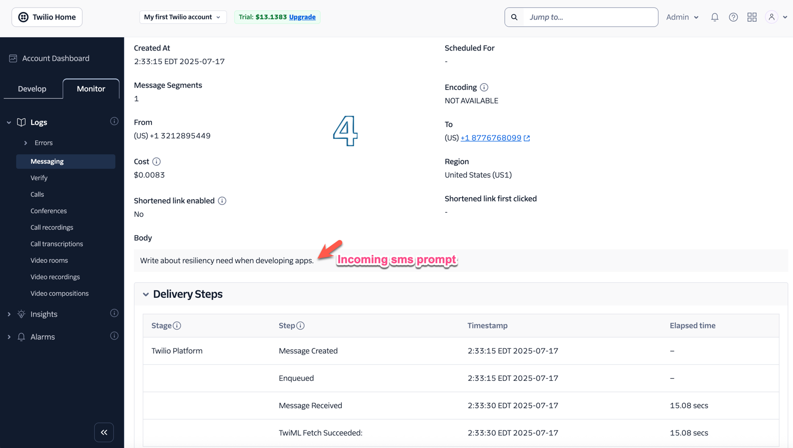
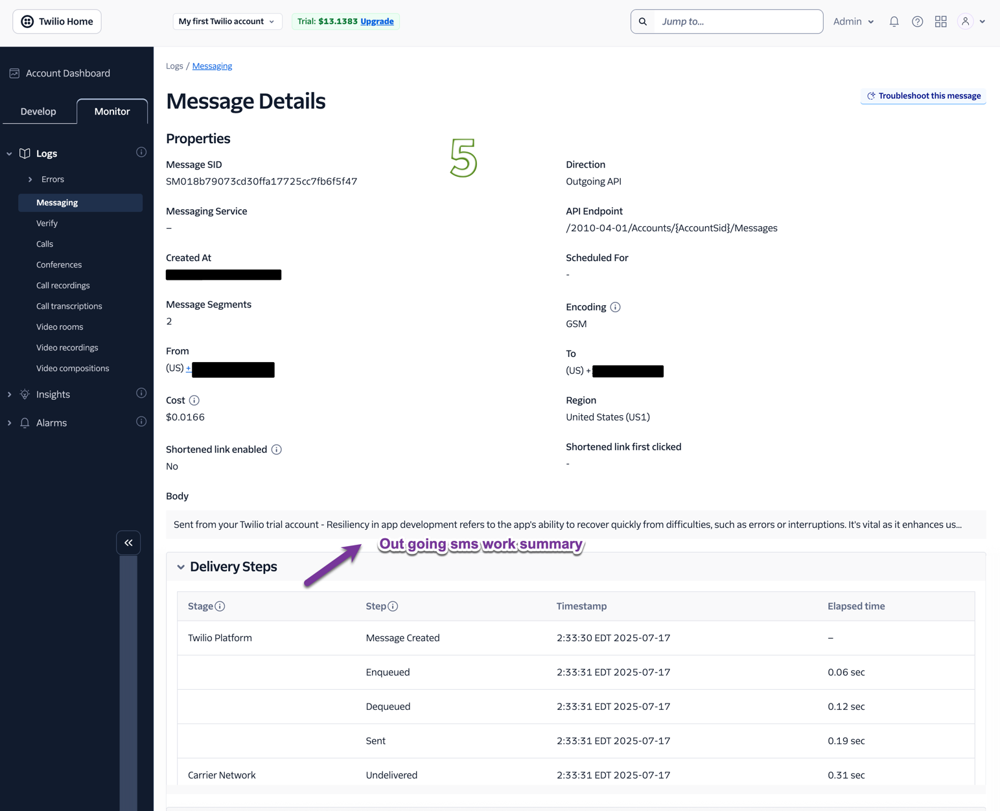

# SMS-to-Cursor Agent System

A system that allows you to send tasks to a Cursor AI agent via SMS and receive SMS-friendly summaries of completed work back on your phone, with voice assistant support for Siri/Alexa integration.

## Features

- 📱 **SMS Integration**: Send tasks via text message to your Cursor AI agent
- 🤖 **Cursor AI Powered**: Uses advanced AI for code generation and technical tasks
- 🧠 **Intelligent Task Routing**: Automatic categorization (coding, debug, design, documentation, analysis)
- 👥 **Multi-Tier User Management**: Free, Premium, Enterprise tiers with smart rate limiting
- 📊 **Advanced Analytics Dashboard**: Real-time monitoring, task insights, and user management
- 📨 **Multi-Channel Notifications**: SMS, Email, Slack, Discord integration
- 🎙️ **Voice Assistant Support**: Text-to-speech and speech-to-text for Siri/Alexa compatibility
- 📱 **SMS-Friendly Responses**: Intelligent summarization for mobile-optimized responses
- 🌐 **Permanent Domains**: Static ngrok URLs for consistent webhook endpoints
- 🐳 **Production-Ready Docker**: Enhanced containerized deployment with health monitoring
- 🔒 **Enterprise Security**: Advanced rate limiting, validation, and admin authentication
- 📈 **Real-time Monitoring**: Comprehensive health checks and system metrics

## 📚 Documentation

- 📖 **[User Guide](USER_GUIDE.md)** - Complete guide to using task routing and advanced features
- 🌐 **[Ngrok Setup](NGROK_SETUP.md)** - How to configure permanent domains
- 🚀 **[Production Setup](PRODUCTION_SETUP.md)** - Complete production deployment guide

## Prerequisites

- Python 3.11+
- Docker and Docker Compose
- Twilio account (for SMS functionality)
- OpenAI API key (for AI integration)
- Ngrok account (for webhook exposure and permanent domains)

## Quick Start

### 1. Clone and Setup

```bash
git clone <repository-url>
cd sms2AIagent
```

### 2. Configure Environment Variables

Copy the example environment file and configure your credentials:

```bash
cp env.example .env
```

Edit `.env` with your actual credentials:

```env
# Twilio Configuration
TWILIO_ACCOUNT_SID=your_twilio_account_sid_here
TWILIO_AUTH_TOKEN=your_twilio_auth_token_here
TWILIO_PHONE_NUMBER=+1234567890

# Cursor AI Configuration
CURSOR_API_KEY=your_cursor_api_key_here
CURSOR_WORKSPACE_ID=your_cursor_workspace_id_here

# OpenAI Configuration (for Cursor AI integration)
OPENAI_API_KEY=your_openai_api_key_here

# Ngrok Configuration
NGROK_AUTHTOKEN=your_ngrok_auth_token_here

# Voice Assistant Configuration (optional)
ENABLE_VOICE_ASSISTANT=True
VOICE_LANGUAGE=en-US
VOICE_RATE=150
```

### 3. Start the System

```bash
docker-compose up --build
```

### 4. Configure Twilio Webhook

1. Go to your Twilio Console
2. Navigate to Phone Numbers → Manage → Active numbers
3. Click on your phone number
4. Set the webhook URL for incoming messages to:
   ```
   https://your-ngrok-url.ngrok-free.app/sms
   ```
   Get your your-ngrok-url here after you stand up the system's container
   ```
   http://0.0.0.0:4040/inspect/http
   ```
5. Set the HTTP method to POST
6. Locally test the system's health and functionality
   ```
   docker-compose exec web python test_setup.py
   ```

### 5. Test the SMS System

Send an SMS to your Twilio phone number with a task like:
- "Write a Python function to calculate fibonacci numbers"
- "Create a React component for a todo list"
- "Explain how Docker containers work"
- "Debug this JavaScript code: [paste code]"

## How It Works

1. **Receive SMS**: Twilio receives your SMS and forwards it to the Flask webhook
2. **Task Analysis**: The system analyzes if your request is a coding task
3. **Cursor AI Processing**: Coding tasks are handled by Cursor AI, general tasks by OpenAI
4. **Voice Response**: If enabled, creates voice-friendly audio responses
5. **Summarization**: The AI response is automatically summarized to fit SMS character limits
6. **Response**: The summarized result is sent back to your phone via SMS

## Voice Assistant Integration

### Siri/Alexa Compatibility

The system includes voice assistant capabilities for integration with Siri and Alexa:

#### Text-to-Speech Endpoint
```bash
curl -X POST http://localhost:5001/voice \
  -H "Content-Type: application/json" \
  -d '{
    "action": "text_to_speech",
    "text": "Your response text here"
  }'
```

#### Speech-to-Text Endpoint
```bash
curl -X POST http://localhost:5001/voice \
  -H "Content-Type: application/json" \
  -d '{
    "action": "speech_to_text",
    "audio_file": "path/to/audio.wav"
  }'
```

#### Monitor Local Ngrok requests
You can monitor your sms post requests here:
```
http://0.0.0.0:4040/inspect/http
```

#### Audio File Access
Generated audio files are available at:
```
http://localhost:5001/audio/filename.mp3
```

### Voice Assistant Features

- **Text-to-Speech**: Converts AI responses to speech
- **Speech-to-Text**: Converts voice input to text
- **Voice Optimization**: Automatically optimizes technical content for voice output
- **Multi-language Support**: Configurable language settings
- **Siri/Alexa Integration**: Compatible with voice assistant platforms

## API Endpoints

- `POST /sms`: Main webhook endpoint for receiving SMS messages from Twilio
- `GET /health`: Health check endpoint
- `POST /voice`: Voice assistant endpoint for Siri/Alexa integration
- `GET /audio/<filename>`: Serve generated audio files
- `GET /cursor/workspace`: Get Cursor workspace information

## Configuration Options

### Voice Assistant Settings

You can customize voice behavior in your `.env` file:

```env
ENABLE_VOICE_ASSISTANT=True
VOICE_LANGUAGE=en-US
VOICE_RATE=150
```

### SMS Length Limits

The system automatically summarizes responses to fit SMS limits:

```env
MAX_SMS_LENGTH=160
```

## Development

### Local Development (without Docker)

```bash
# Create virtual environment
python -m venv .venv
source .venv/bin/activate  # On Windows: .venv\Scripts\activate

# Install dependencies
pip install -r requirements.txt

# Run the application
python app.py
```

### Testing

Run the comprehensive test suite:

```bash
python test_setup.py
```

This will test:
- Environment variables
- Cursor AI integration
- Voice assistant functionality
- Twilio API connection
- Flask application

## Troubleshooting

### Common Issues

1. **"Cursor AI agent not initialized"**: Check your CURSOR_API_KEY and OPENAI_API_KEY
2. **"Voice assistant not enabled"**: Set ENABLE_VOICE_ASSISTANT=True in your .env file
3. **"Twilio webhook not receiving messages"**: Ensure the webhook URL is correctly configured
4. **"Audio files not accessible"**: Check file permissions and ensure the audio directory exists

### Logs

Check the Docker logs for detailed error information:

```bash
docker-compose logs web
docker-compose logs ngrok
```

## Security and Future Considerations

- Keep your API keys secure and never commit them to version control
- The `.env` file is already in `.gitignore` for security
- Consider implementing rate limiting for production use
- Review and adjust voice assistant settings based on your use case
- Consider further enhancements (e.g., error handling, logging, advanced task routing, admin dashboard, analytics, etc.)

## Successful Test Results

### Dev server


### Webhook receiver


### Twilio incoming and outgoing sms logs with message bodies


### Incoming sms message with work detail


### outgoing sms message detail with work summary


