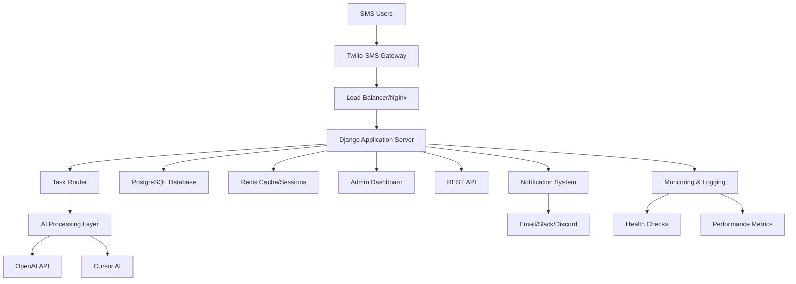
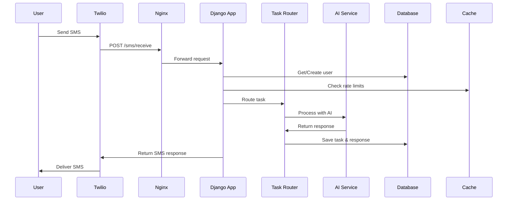
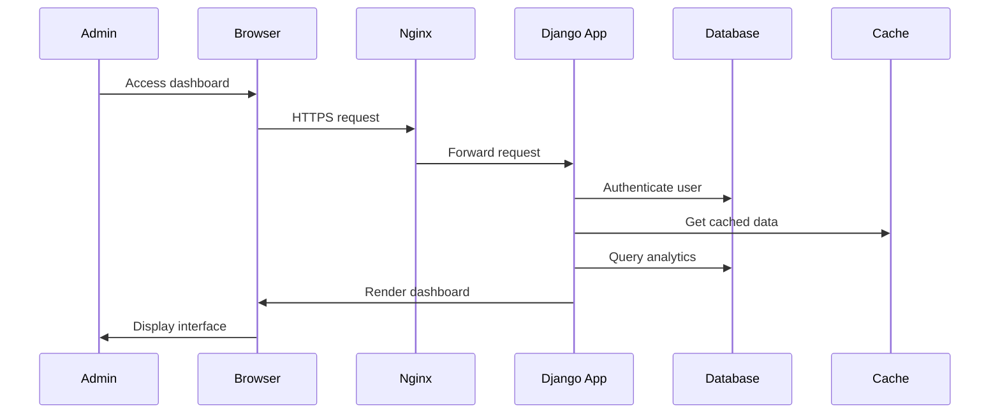
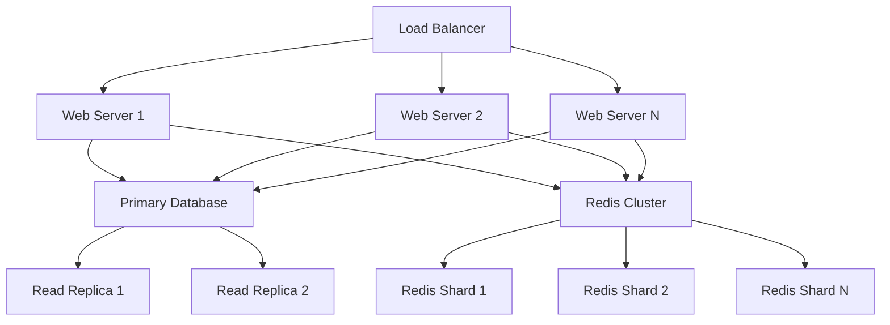
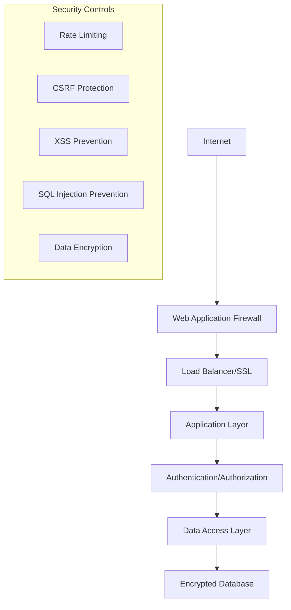
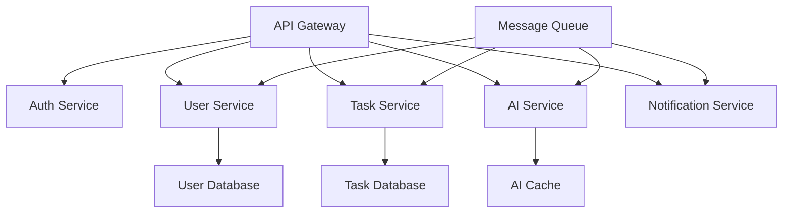

# 🏗️ System Architecture

**Complete architectural overview and design documentation for SMS-to-AI Agent**

---

## 📋 **Overview**

The SMS-to-AI Agent is a sophisticated, production-ready system that transforms SMS messages into intelligent AI-powered responses. Built with scalability, reliability, and maintainability in mind, the architecture follows modern best practices and design patterns.

---

## 🎯 **High-Level Architecture**



---

## 🏢 **System Components**

### **1. Communication Layer**

#### **Twilio SMS Gateway**
- **Purpose**: SMS message ingestion and delivery
- **Features**:
  - Webhook-based message processing
  - Delivery status tracking
  - Phone number validation
  - International SMS support
- **Integration**: REST API with signature verification

#### **Load Balancer (Nginx)**
- **Purpose**: Request distribution and SSL termination
- **Features**:
  - HTTPS/SSL certificate management
  - Static file serving
  - Request routing
  - Rate limiting
  - Health checks

### **2. Application Layer**

#### **Django Web Framework**
- **Purpose**: Core application logic and web interface
- **Components**:
  - **Models**: Data models with PostgreSQL ORM
  - **Views**: Request processing and business logic
  - **Templates**: Admin dashboard UI
  - **Middleware**: Authentication, CORS, security
- **Features**:
  - RESTful API with Django REST Framework
  - Built-in admin interface
  - Session management
  - CSRF protection

#### **Task Router**
- **Purpose**: Intelligent message categorization and routing
- **Features**:
  - Content analysis and classification
  - Priority assignment
  - AI model selection
  - Response optimization
- **Categories**: Coding, Debug, Design, Documentation, Analysis, General

#### **AI Processing Layer**
- **Purpose**: AI model integration and response generation
- **Components**:
  - **OpenAI Integration**: GPT-4 for general tasks
  - **Cursor AI Integration**: Specialized coding assistance
  - **Response Generator**: Context-aware response formatting
  - **Token Management**: Usage tracking and optimization

### **3. Data Layer**

#### **PostgreSQL Database**
- **Purpose**: Primary data storage with ACID compliance
- **Features**:
  - User management and profiles
  - Task history and analytics
  - Error logging and tracking
  - JSONB support for flexible data
- **Optimization**: Indexing, connection pooling, partitioning

#### **Redis Cache**
- **Purpose**: High-performance caching and session storage
- **Features**:
  - Session management
  - Rate limiting counters
  - Query result caching
  - Real-time data storage

### **4. Management Layer**

#### **Admin Dashboard**
- **Purpose**: Web-based system management
- **Features**:
  - User management and tier controls
  - Real-time analytics and metrics
  - System monitoring and health checks
  - Message broadcasting capabilities

#### **REST API**
- **Purpose**: Programmatic system access
- **Features**:
  - Comprehensive CRUD operations
  - Authentication and authorization
  - Rate limiting and throttling
  - API documentation and testing

### **5. Operations Layer**

#### **Monitoring & Logging**
- **Purpose**: System observability and debugging
- **Features**:
  - Application logging with rotation
  - Performance metrics collection
  - Error tracking and alerting
  - Health check endpoints

#### **Notification System**
- **Purpose**: Multi-channel alert delivery
- **Features**:
  - Email notifications via SMTP
  - Slack integration
  - Discord webhooks
  - Custom webhook support

---

## 🔧 **Detailed Component Architecture**

### **Django Application Structure**

```
sms2AIagent/
├── core/                       # Core application
│   ├── models.py              # Data models
│   ├── views.py               # API views
│   ├── serializers.py         # DRF serializers
│   ├── urls.py                # URL routing
│   └── admin.py               # Django admin config
├── admin_dashboard/            # Custom admin interface
│   ├── views.py               # Dashboard views
│   ├── urls.py                # Dashboard routing
│   └── templates/             # Dashboard templates
├── sms_agent/                  # Django project settings
│   ├── settings/              # Environment-specific settings
│   │   ├── base.py           # Base settings
│   │   ├── development.py    # Development settings
│   │   └── production.py     # Production settings
│   ├── urls.py                # Main URL configuration
│   └── wsgi.py                # WSGI application
├── templates/                  # Template files
├── static/                     # Static files
├── logs/                       # Application logs
└── requirements.txt            # Python dependencies
```

### **Database Schema Design**

```sql
-- Core entity relationships
Users (1) ←→ (N) Tasks
Users (1) ←→ (N) ErrorLogs
Tasks (1) ←→ (N) ErrorLogs

-- User management
CREATE TABLE users (
    phone_number VARCHAR(17) PRIMARY KEY,  -- E.164 format
    tier VARCHAR(20) DEFAULT 'free',
    email VARCHAR(255),
    full_name VARCHAR(255),
    created_at TIMESTAMP DEFAULT NOW(),
    last_active TIMESTAMP DEFAULT NOW(),
    total_requests INTEGER DEFAULT 0,
    monthly_requests INTEGER DEFAULT 0,
    rate_limit_reset TIMESTAMP DEFAULT NOW(),
    timezone VARCHAR(50) DEFAULT 'UTC',
    preferences JSONB DEFAULT '{}'
);

-- Task processing
CREATE TABLE tasks (
    id BIGSERIAL PRIMARY KEY,
    user_phone VARCHAR(17) REFERENCES users(phone_number),
    sms_content TEXT NOT NULL,
    ai_response TEXT,
    category VARCHAR(50) DEFAULT 'general',
    processing_time FLOAT DEFAULT 0.0,
    tokens_used INTEGER DEFAULT 0,
    complexity_score FLOAT DEFAULT 1.0,
    success BOOLEAN DEFAULT TRUE,
    error_message TEXT,
    created_at TIMESTAMP DEFAULT NOW(),
    completed_at TIMESTAMP,
    metadata JSONB DEFAULT '{}'
);

-- Error tracking
CREATE TABLE error_logs (
    id BIGSERIAL PRIMARY KEY,
    user_phone VARCHAR(17) REFERENCES users(phone_number),
    task_id BIGINT REFERENCES tasks(id),
    error_type VARCHAR(50) NOT NULL,
    error_message TEXT NOT NULL,
    stack_trace TEXT,
    timestamp TIMESTAMP DEFAULT NOW(),
    resolved BOOLEAN DEFAULT FALSE,
    metadata JSONB DEFAULT '{}'
);
```

---

## 🔄 **Data Flow Architecture**

### **SMS Processing Flow**



### **Admin Dashboard Flow**



---

## 🚀 **Scalability Architecture**

### **Horizontal Scaling Strategy**



### **Scaling Tiers**

#### **Tier 1: Single Instance (< 100 users)**
- Single Django application server
- PostgreSQL database
- Redis cache
- Basic monitoring

#### **Tier 2: Load Balanced (100-1,000 users)**
- Load balancer (Nginx)
- Multiple Django instances
- PostgreSQL with read replicas
- Redis cluster
- Enhanced monitoring

#### **Tier 3: Microservices (1,000+ users)**
- Service mesh architecture
- Dedicated AI processing service
- Database sharding
- Message queues
- Comprehensive monitoring

#### **Tier 4: Multi-Region (Enterprise)**
- Geographic distribution
- Database replication
- CDN integration
- Disaster recovery

---

## 🔐 **Security Architecture**

### **Security Layers**



### **Security Features**

#### **Network Security**
- SSL/TLS encryption (HTTPS)
- Certificate management
- Firewall configuration
- DDoS protection

#### **Application Security**
- CSRF token validation
- XSS protection
- SQL injection prevention
- Input validation and sanitization

#### **Authentication & Authorization**
- Session-based authentication
- Token-based API access
- Role-based access control
- Admin privilege management

#### **Data Security**
- Database encryption at rest
- Encrypted environment variables
- Secure password hashing
- PII data protection

---

## 📊 **Performance Architecture**

### **Performance Optimization Strategies**

#### **Database Optimization**
```sql
-- Strategic indexing
CREATE INDEX idx_tasks_user_created ON tasks(user_phone, created_at DESC);
CREATE INDEX idx_users_tier_active ON users(tier, last_active);
CREATE INDEX idx_error_logs_type_timestamp ON error_logs(error_type, timestamp DESC);

-- Query optimization
EXPLAIN ANALYZE SELECT * FROM tasks 
WHERE user_phone = '+1234567890' 
AND created_at >= NOW() - INTERVAL '30 days'
ORDER BY created_at DESC;
```

#### **Caching Strategy**
```python
# Redis caching implementation
from django.core.cache import cache

def get_user_analytics(phone_number):
    cache_key = f"user_analytics_{phone_number}"
    data = cache.get(cache_key)
    
    if data is None:
        data = calculate_user_analytics(phone_number)
        cache.set(cache_key, data, timeout=3600)  # 1 hour
    
    return data
```

#### **Database Connection Pooling**
```python
# Connection pooling configuration
DATABASES = {
    'default': {
        'ENGINE': 'django.db.backends.postgresql',
        'NAME': 'sms_agent_db',
        'USER': 'sms_agent',
        'PASSWORD': 'password',
        'HOST': 'database',
        'PORT': '5432',
        'CONN_MAX_AGE': 600,
        'CONN_HEALTH_CHECKS': True,
        'OPTIONS': {
            'MAX_CONNS': 20,
            'MIN_CONNS': 5,
        }
    }
}
```

---

## 🔄 **Integration Architecture**

### **External Service Integrations**

#### **Twilio Integration**
```python
class TwilioService:
    def __init__(self):
        self.client = Client(
            settings.TWILIO_ACCOUNT_SID,
            settings.TWILIO_AUTH_TOKEN
        )
    
    def send_sms(self, to, message):
        return self.client.messages.create(
            body=message,
            from_=settings.TWILIO_PHONE_NUMBER,
            to=to
        )
    
    def verify_webhook(self, request):
        return self.client.request_validator.validate(
            request.build_absolute_uri(),
            request.POST,
            request.META.get('HTTP_X_TWILIO_SIGNATURE', '')
        )
```

#### **OpenAI Integration**
```python
class OpenAIService:
    def __init__(self):
        openai.api_key = settings.OPENAI_API_KEY
    
    def generate_response(self, prompt, model="gpt-4"):
        response = openai.ChatCompletion.create(
            model=model,
            messages=[{"role": "user", "content": prompt}],
            max_tokens=settings.OPENAI_MAX_TOKENS,
            temperature=settings.OPENAI_TEMPERATURE
        )
        return response.choices[0].message.content
```

---

## 🧪 **Testing Architecture**

### **Testing Strategy**

```python
# Unit testing example
class TaskProcessingTestCase(TestCase):
    def setUp(self):
        self.user = User.objects.create(
            phone_number='+1234567890',
            tier='premium'
        )
        
    def test_task_creation(self):
        task = Task.objects.create(
            user_phone=self.user.phone_number,
            sms_content="Help with Python",
            category="coding"
        )
        self.assertEqual(task.category, "coding")
        self.assertTrue(task.success)

# Integration testing
class SMSWebhookTestCase(TestCase):
    def test_sms_webhook(self):
        response = self.client.post('/sms/receive', {
            'From': '+1234567890',
            'Body': 'Test message',
            'MessageSid': 'test123'
        })
        self.assertEqual(response.status_code, 200)
```

### **Testing Layers**
- **Unit Tests**: Individual component testing
- **Integration Tests**: Component interaction testing
- **API Tests**: REST API endpoint testing
- **End-to-End Tests**: Complete workflow testing
- **Load Tests**: Performance and scalability testing

---

## 📈 **Monitoring Architecture**

### **Observability Stack**

```python
# Logging configuration
LOGGING = {
    'version': 1,
    'handlers': {
        'file': {
            'level': 'INFO',
            'class': 'logging.handlers.RotatingFileHandler',
            'filename': 'logs/app.log',
            'maxBytes': 1024*1024*15,
            'backupCount': 10,
        },
        'error_file': {
            'level': 'ERROR',
            'class': 'logging.handlers.RotatingFileHandler',
            'filename': 'logs/errors.log',
        }
    },
    'loggers': {
        'sms_agent': {
            'handlers': ['file', 'error_file'],
            'level': 'INFO',
        }
    }
}
```

### **Health Check Implementation**

```python
class HealthCheckView(APIView):
    def get(self, request):
        health_data = {
            'status': 'healthy',
            'timestamp': timezone.now(),
            'services': {
                'database': self._check_database(),
                'redis': self._check_redis(),
                'openai': self._check_openai(),
                'twilio': self._check_twilio()
            }
        }
        return Response(health_data)
```

---

## 🔮 **Future Architecture Considerations**

### **Microservices Migration Path**



### **Event-Driven Architecture**

```python
# Event sourcing example
class TaskCreatedEvent:
    def __init__(self, task_id, user_phone, content):
        self.task_id = task_id
        self.user_phone = user_phone
        self.content = content
        self.timestamp = timezone.now()

class EventBus:
    def publish(self, event):
        # Publish to message queue
        pass
    
    def subscribe(self, event_type, handler):
        # Subscribe to event type
        pass
```

---

## 📚 **Architecture Documentation**

### **Design Patterns Used**

- **MVC (Model-View-Controller)**: Django framework structure
- **Repository Pattern**: Data access abstraction
- **Factory Pattern**: Service object creation
- **Singleton Pattern**: Configuration management
- **Observer Pattern**: Event notification system
- **Strategy Pattern**: AI model selection

### **Architectural Principles**

- **Separation of Concerns**: Clear component boundaries
- **Single Responsibility**: Each component has one purpose
- **Open/Closed Principle**: Extensible without modification
- **Dependency Inversion**: Depend on abstractions
- **SOLID Principles**: Object-oriented design
- **12-Factor App**: Cloud-native application methodology

---

## 🔗 **Related Documentation**

- **[Database Guide](DATABASE.md)** - Database schema and operations
- **[API Reference](../user-guides/API_REFERENCE.md)** - REST API documentation
- **[Production Guide](../operations/PRODUCTION.md)** - Deployment architecture
- **[Configuration Guide](../getting-started/CONFIGURATION.md)** - System configuration

---

**🏗️ This architecture provides a solid foundation for a scalable, maintainable, and robust SMS-to-AI Agent system!** 